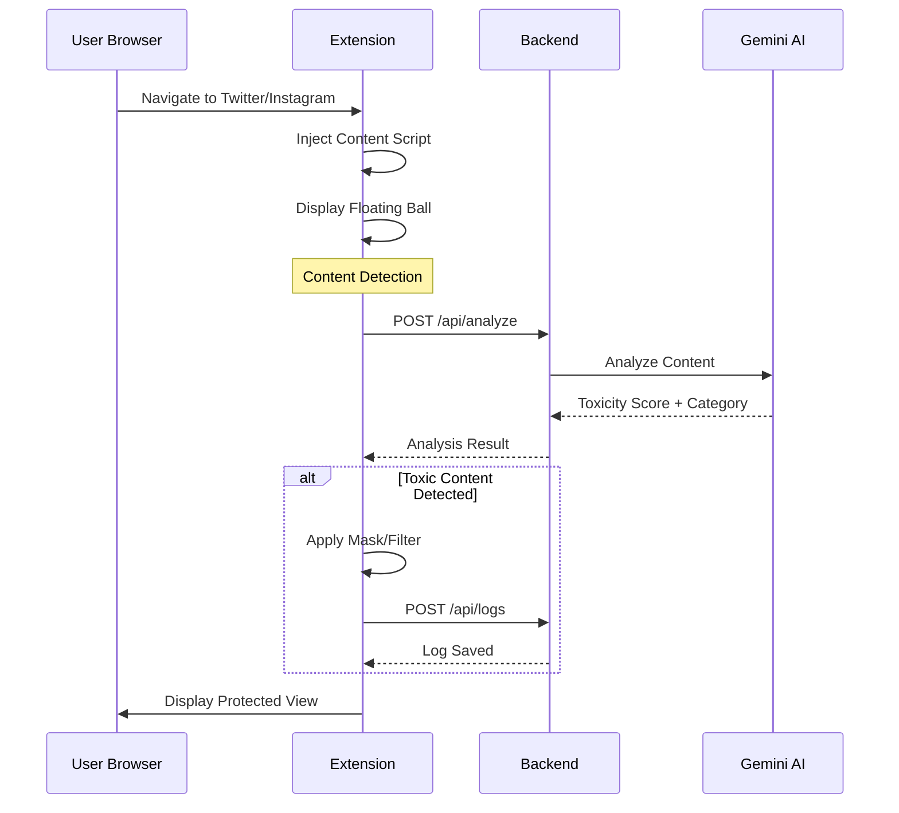

<](https://www.typescriptlang.org/)
[](https://react.dev/)
[](https://bun.sh/)
[](https://ai.google.dev/)
[](https://developer.chrome.com/docs/extensions/)
[](LICENSE)

---

**ZenShield** is a comprehensive anti-cyberbullying solution designed to protect content creators from online harassment. Using Google's Gemini AI for real-time content analysis, it acts as a "psychological buffer" between creators and potentially harmful interactions.

[Demo](#demo-simulator) | [Dashboard](#dashboard) | [Extension](#chrome-extension) | [API](#api-reference)

</div>

---

## Table of Contents

- [Features](#features)
- [Architecture](#architecture)
- [Quick Start](#quick-start)
  - [Prerequisites](#prerequisites)
  - [Backend Setup](#backend-setup)
  - [Frontend Setup](#frontend-setup)
  - [Extension Installation](#extension-installation)
- [Project Structure](#project-structure)
- [Protection Modes](#protection-modes)
- [Tech Stack](#tech-stack)
- [Documentation](#documentation)
- [Contributing](#contributing)
- [License](#license)

---

## Features

### Real-time Content Analysis with Gemini AI

- **Intelligent Detection**: Leverages Google's Gemini AI to analyze comments, messages, and mentions in real-time
- **Multi-language Support**: Detects toxic content in multiple languages including English and Chinese
- **Context-Aware Analysis**: Understands sarcasm, hidden aggression, and subtle harassment patterns
- **Categorization**: Classifies threats into categories (hate speech, harassment, threats, etc.)

### Chrome Extension with Floating Ball Widget

- **Non-intrusive UI**: A floating ball widget that stays accessible on supported platforms
- **Instant Feedback**: Real-time interception counts and status updates
- **One-Click Protection**: Toggle protection modes with a single click
- **Platform Integration**: Seamlessly works on Twitter/X and Instagram

### Dashboard for Monitoring and Configuration

- **Overview Dashboard**: At-a-glance statistics and trend visualization
- **Interception Logs**: Detailed history of all blocked content with evidence preservation
- **Defense Rules**: Customizable filtering rules and response actions
- **Profile Management**: Account settings and subscription status

### Demo/Simulator for Testing

- **Web Playground**: Test the protection system without installing the extension
- **Preset Samples**: Pre-configured toxic and normal content for demonstration
- **Real AI Integration**: Actual Gemini API calls for authentic experience
- **Interactive Controls**: Toggle protection modes and observe real-time effects

### Protection Modes

| Mode | Description | Use Case |
|------|-------------|----------|
| **Daily** | Low-power monitoring with basic filtering | Normal everyday usage |
| **Crisis** | Full-power AI analysis with aggressive filtering | During active harassment |
| **Ended** | Post-crisis mode with summary and recovery options | After crisis resolution |

---

## Architecture

```
+------------------------------------------------------------------+
|                         ZenShield System                          |
+------------------------------------------------------------------+
                                |
        +--------------------------------------------------+
        |                                                  |
        v                                                  v
+----------------+                              +------------------+
|   Extension    |                              |    Dashboard     |
|   (Chrome)     |                              |    (Web App)     |
+----------------+                              +------------------+
|  - Popup UI    |                              |  - Overview      |
|  - Float Ball  |                              |  - Logs          |
|  - Content     |                              |  - Rules         |
|    Scripts     |                              |  - Simulator     |
+-------+--------+                              +--------+---------+
        |                                                |
        |              +------------------+              |
        +------------->|    Backend API   |<-------------+
                       |     (Hono/Bun)   |
                       +------------------+
                       |  /api/analyze    |
                       |  /api/protection |
                       |  /api/logs       |
                       |  /api/events     |
                       +--------+---------+
                                |
                       +--------v---------+
                       |   Gemini AI API  |
                       |   (Google)       |
                       +------------------+
                       |  Content         |
                       |  Analysis        |
                       |  Toxicity        |
                       |  Detection       |
                       +------------------+
```

### Data Flow



---

## Quick Start

### Prerequisites

Before you begin, ensure you have the following installed:

| Requirement | Version | Purpose |
|-------------|---------|---------|
| [Bun](https://bun.sh) | >= 1.3 | JavaScript runtime and package manager |
| [Node.js](https://nodejs.org) | >= 18 | Fallback runtime (optional) |
| [Google Chrome](https://www.google.com/chrome/) | Latest | Extension host browser |
| [Gemini API Key](https://ai.google.dev/) | - | AI content analysis |

### Backend Setup

1. **Navigate to the backend directory**

   ```bash
   cd backend
   ```

2. **Install dependencies**

   ```bash
   bun install
   ```

3. **Configure environment variables**

   Create a `.env` file in the backend directory:

   ```env
   PORT=3000
   GEMINI_API_KEY=your_gemini_api_key_here
   SUPABASE_URL=your_supabase_url (optional)
   SUPABASE_ANON_KEY=your_supabase_anon_key (optional)
   ```

4. **Start the development server**

   ```bash
   bun run dev
   ```

   The API server will start at `http://localhost:3000`

5. **Verify the server is running**

   ```bash
   curl http://localhost:3000/health
   # Expected: {"status":"ok"}
   ```

### Frontend Setup

1. **Navigate to the frontend directory**

   ```bash
   cd frontend
   ```

2. **Install dependencies**

   ```bash
   bun install
   ```

3. **Configure environment variables**

   Create a `.env` file in the frontend directory:

   ```env
   VITE_API_URL=http://localhost:3000
   ```

4. **Start the development server**

   ```bash
   bun run dev
   ```

   The dashboard will be available at `http://localhost:5173`

### Extension Installation

1. **Navigate to the extension directory**

   ```bash
   cd extension
   ```

2. **Install dependencies**

   ```bash
   bun install
   ```

3. **Build the extension**

   ```bash
   bun run build
   ```

4. **Load the extension in Chrome**

   - Open Chrome and navigate to `chrome://extensions/`
   - Enable "Developer mode" (toggle in the top right)
   - Click "Load unpacked"
   - Select the `extension/dist` folder

5. **Pin the extension**

   - Click the puzzle piece icon in the Chrome toolbar
   - Click the pin icon next to "ZenShield"

---

## Project Structure

```
shield/
+-- backend/                    # API Server
|   +-- src/
|   |   +-- index.ts           # Main entry point (Hono server)
|   |   +-- middleware/        # Authentication middleware
|   |   +-- routes/            # API route handlers
|   |   |   +-- analyze.ts     # Content analysis endpoints
|   |   |   +-- auth.ts        # Authentication endpoints
|   |   |   +-- events.ts      # Real-time event endpoints
|   |   |   +-- logs.ts        # Interception log endpoints
|   |   |   +-- protection.ts  # Protection mode endpoints
|   |   +-- services/          # Business logic
|   |       +-- gemini.ts      # Gemini AI integration
|   +-- package.json
|   +-- tsconfig.json
|
+-- frontend/                   # Dashboard Web Application
|   +-- src/
|   |   +-- App.tsx            # Main application component
|   |   +-- main.tsx           # Entry point
|   |   +-- components/        # Reusable UI components
|   |   |   +-- Sidebar.tsx
|   |   |   +-- TopBar.tsx
|   |   |   +-- StatCard.tsx
|   |   |   +-- TrendChart.tsx
|   |   |   +-- StatusBanner.tsx
|   |   |   +-- RecentInterceptions.tsx
|   |   |   +-- simulator/     # Demo simulator components
|   |   |       +-- TwitterFeed.tsx
|   |   |       +-- TweetCard.tsx
|   |   |       +-- ControlPanel.tsx
|   |   |       +-- FloatingBall.tsx
|   |   |       +-- ToxicOverlay.tsx
|   |   +-- layouts/           # Layout components
|   |   |   +-- DashboardLayout.tsx
|   |   +-- pages/             # Page components
|   |       +-- Overview.tsx   # Main dashboard
|   |       +-- Logs.tsx       # Interception logs
|   |       +-- Rules.tsx      # Defense rules
|   |       +-- Profile.tsx    # User profile
|   |       +-- Simulator.tsx  # Demo playground
|   +-- package.json
|   +-- vite.config.ts
|   +-- tailwind.config.js
|
+-- extension/                  # Chrome Extension
|   +-- src/
|   |   +-- background/        # Service worker
|   |   |   +-- index.ts
|   |   +-- content/           # Content scripts
|   |   |   +-- index.tsx      # Content script entry
|   |   |   +-- FloatingBall.tsx
|   |   |   +-- components/    # Floating ball panels
|   |   |       +-- DailyPanel.tsx
|   |   |       +-- CrisisPanel.tsx
|   |   |       +-- EndedPanel.tsx
|   |   |       +-- ConfirmModal.tsx
|   |   +-- popup/             # Extension popup
|   |       +-- App.tsx
|   |       +-- main.tsx
|   |       +-- pages/         # Popup pages by mode
|   |       |   +-- DailyMode.tsx
|   |       |   +-- AlertMode.tsx
|   |       |   +-- CrisisMode.tsx
|   |       |   +-- ConfirmModal.tsx
|   |       +-- components/    # Popup UI components
|   |           +-- Header.tsx
|   |           +-- ShieldIcon.tsx
|   |           +-- StatCard.tsx
|   |           +-- BottomNav.tsx
|   +-- manifest.json          # Chrome extension manifest
|   +-- package.json
|   +-- vite.config.ts
|
+-- docs/                       # Documentation
|   +-- README.md              # This file
|   +-- DEMO.md                # Demo guide
|   +-- DASHBOARD.md           # Dashboard guide
|   +-- EXTENSION.md           # Extension guide
|   +-- API.md                 # API reference
|
+-- prd.md                      # Product Requirements Document
```

---

## Protection Modes

ZenShield operates in three distinct protection modes, designed to adapt to different threat levels:

### Daily Mode (Low Power)

- **Status**: Normal operation
- **AI Usage**: Lightweight, periodic scanning
- **Actions**: Basic keyword filtering, simple pattern matching
- **UI**: Green shield indicator, minimal notifications

```
+-------------------+
|    Daily Mode     |
+-------------------+
| Shield Status: ON |
| Intercepted: 12   |
| [View Dashboard]  |
+-------------------+
```

### Crisis Mode (Full Power)

- **Status**: Active threat response
- **AI Usage**: Real-time Gemini analysis for every interaction
- **Actions**: Aggressive filtering, auto-blocking, evidence collection
- **UI**: Red shield indicator, active blocking notifications

```
+-------------------+
|   Crisis Mode     |
+-------------------+
| SHIELD ACTIVE     |
| Blocked: 156      |
| Threats: 23       |
| [End Crisis]      |
+-------------------+
```

### Ended Mode (Post-Crisis)

- **Status**: Crisis resolved
- **AI Usage**: Summary generation
- **Actions**: Report generation, recovery recommendations
- **UI**: Blue shield indicator, summary display

```
+-------------------+
|   Crisis Ended    |
+-------------------+
| Duration: 2h 15m  |
| Total Blocked: 312|
| [View Report]     |
| [Return to Daily] |
+-------------------+
```

---

## Tech Stack

### Backend

| Technology | Purpose |
|------------|---------|
| [Bun](https://bun.sh) | JavaScript runtime and package manager |
| [Hono](https://hono.dev) | Lightweight web framework |
| [Google Gemini AI](https://ai.google.dev) | Content analysis and toxicity detection |
| [Supabase](https://supabase.com) | Authentication and database (optional) |
| TypeScript | Type-safe development |

### Frontend (Dashboard)

| Technology | Purpose |
|------------|---------|
| [React 19](https://react.dev) | UI framework |
| [Vite](https://vitejs.dev) | Build tool and dev server |
| [Tailwind CSS 4](https://tailwindcss.com) | Utility-first styling |
| [React Router](https://reactrouter.com) | Client-side routing |
| [Recharts](https://recharts.org) | Data visualization |
| TypeScript | Type-safe development |

### Extension

| Technology | Purpose |
|------------|---------|
| [React 19](https://react.dev) | UI framework |
| [Vite](https://vitejs.dev) | Build tool |
| [CRXJS](https://crxjs.dev) | Chrome extension Vite plugin |
| [Tailwind CSS 4](https://tailwindcss.com) | Styling |
| Chrome Manifest V3 | Extension framework |
| TypeScript | Type-safe development |

---

## Documentation

Detailed documentation is available for each component:

| Document | Description |
|----------|-------------|
| [Demo Guide](./DEMO.md) | How to use the demo simulator |
| [Dashboard Guide](./DASHBOARD.md) | Dashboard features and usage |
| [Extension Guide](./EXTENSION.md) | Extension installation and usage |
| [API Reference](./API.md) | Backend API documentation |

---

## API Endpoints

### Quick Reference

| Endpoint | Method | Description |
|----------|--------|-------------|
| `/health` | GET | Health check |
| `/api/auth/login` | POST | User authentication |
| `/api/auth/demo` | POST | Demo mode authentication |
| `/api/analyze` | POST | Analyze content for toxicity |
| `/api/protection/status` | GET | Get current protection status |
| `/api/protection/mode` | PUT | Change protection mode |
| `/api/logs` | GET | Get interception logs |
| `/api/logs` | POST | Create interception log |
| `/api/events` | GET | Get real-time events (SSE) |

For detailed API documentation, see [API Reference](./API.md).

---

## Environment Variables

### Backend (.env)

```env
# Required
GEMINI_API_KEY=your_gemini_api_key

# Optional - Server
PORT=3000

# Optional - Supabase (for persistent storage)
SUPABASE_URL=your_supabase_url
SUPABASE_ANON_KEY=your_supabase_anon_key
```

### Frontend (.env)

```env
# Required
VITE_API_URL=http://localhost:3000
```

---

## Contributing

We welcome contributions! Please see our contributing guidelines for more details.

1. Fork the repository
2. Create a feature branch (`git checkout -b feature/amazing-feature`)
3. Commit your changes (`git commit -m 'Add amazing feature'`)
4. Push to the branch (`git push origin feature/amazing-feature`)
5. Open a Pull Request

---

## License

This project is licensed under the MIT License - see the [LICENSE](../LICENSE) file for details.

---

<div align="center">

**Built with care for content creators worldwide**

[Report Bug](https://github.com/your-repo/issues) | [Request Feature](https://github.com/your-repo/issues)

</div>
]]>